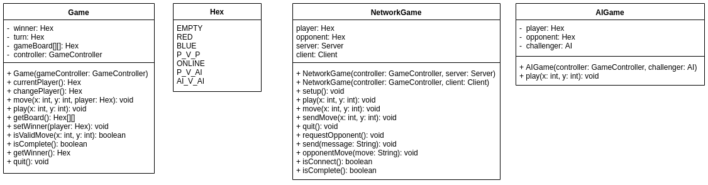

# Report: HexAlpha

## Overview

The specification requires that a game of Hex be implemented. Which matches the rules and specifications provided by:`https://en.wikipedia.org/wiki/Hex_(board_game)`  This game of hex would require:

* Allow players to play over a network.
* Allow for player vs AI
* Allow for AI vs AI.
* Metrics for testing the effectiveness of AI.

### Problem Decomposition

To allow for the program to meet the functionality required, The following problems must be solved:

* A GUI to obtain input
* Algorithm to determine when a game of Hex is complete.
* Use of sockets to allow for network communication.
* AI algorithm design.

## Design

### GUI

The GUI of the application was designed using JavaFX. This allowed for the creation of an aesthetic and interactive UI which would make it easy for users to easily navigate the Application.

#### Game Controller

The pieces of the game board were designed in `Inkscape` and then exported to `.png`. 3 Hex pieces were designed (`RED`, `BLUE`, `EMPTY`) and when they are changed on the board only the link to the Image View is changed. Designing the board in the way it was allowed for the game to be more interactive making it easier for the user to actually input into the program and it also made it easier to test as the positions on the board can be seen visually. A look up was used to find the specific image view that corresponded to the location on the hex board.

### Game Mechanics

The board was stored as an `11 x 11` 2D array of `Enum`s. All empty pieces were donated by `EMPTY` .  When a player places a piece at a location the location is represented in the 2D array by the name of the player. This allowed for fast access of different locations on the board. Allowing for instant piece placement.  

#### Determining the End of a Game

The method used to determine if a game of hex was complete was as follows:

* Determine if the player has a piece of their own on their side.
* find the neighbours of that piece and the neighbours of neighbours until there are no more neighbours or until there is a path of neighbours to the other side of players.

To increase the speed of this process and ensure the program does not get stuck in a loop of neighbours when a neighbour has been search it is not searched again. This method was used as the game board was implemented as a 2D array so there were no explicit link between each of the pieces, so the hexagonal structure was donated mathematically.

To determine if a game was complete as new class was created. This was implemented as its own class because it allows for all the code which relates to the completion of the game to be stored inside one location. It also allowed for the completion method to be reused by AIs. Also it decreases the size of the Game class. It also encapsulated variables which need to be set to default values every time it is wished to determine if the game is complete.

### Network

To allow the user to play with others over a network there was implementation of sockets. Since the game would have to be implemented as peer to peer. It would not be possible to create a lobby for users to find each other. So to allow for users to find each other there IP addresses have to be displayed. So it was decided two classes would be used for this (`Server`, `Client`). The server would be the person hosting the game, displaying their IP address and the Client the person who connects to the other persons IP address.  Communication between the Client and the Server followed the protocol specification provided by the practical.

To allow the user to both use the GUI and interact with the client at the same time multi-threading was used. Receiving of moves was always carried out on another thread so the user could quit while the game was still in progress.

The Network Game was implemented as a sub-class of the game class since if carried out all the same functionality, so the network class was thought of as extending the functionality of the initial class.

### Challenger

#### Random ####

A random AI was created which generates 2 random numbers and if the board position the AI puts a hex piece on that position.

### AI: Minimax with Alpha-Beta Pruning

A more sophisticated AI was developed. This AI used minimax with alpha beta pruning. The minimax algorithm worked by getting all the possible moves and evaluating there score using the evaluation function and then evaluates all the opponents positions and chooses the one with the optimal evaluation of the possible moves given and so on and so forth this the maximum depth is reached then the move selected will be the one which leads to the optimal evaluation for the given player. Alpha-Beta pruning allow for possible paths which are irrelevant which cant be reached since the other player would not choose them to avoid the ban evaluation are just skipped. However it is to note that pruning in not guaranteed.  This algorithm assumes both players are playing using the same strategy which may be a fault in the AI design as it may perform poorly against other strategies.

In this minimax algorithm Red is trying to minimise the evaluation where as Blue is trying to maximise the evaluation

##### Possible Moves

This algorithm does not define possible moves to be all positions on the board. Valid pieces on the board are adjacent pieces to pieces which are currently on there board or bridges where the two connecting adjacent pieces are empty. Only if there are not valid moves the AI then generates 10 random moves to evaluate.

##### Evaluation Function

The evaluation of a move was determined by taking the board and determining the longest path for each player from one of their sides to the other and the evaluation would be the length of the longest blue path substract the longest red path. An additional evaluation was added as well if a bridge was added to the board and the move was being evaluated the bridge would be considered  to be adding possibly 2 on the path. This was designed this way to encourage the AI to make bridges to increase the chance of completing a path.

## Testing

##### Test 1 - Quit

This test was used to ensure that a player can quit the game whilst playing.

###### Expected

Upon the user pressing the quit button the game should end. 

###### Actual

The program successfully returns to the menu screen. 

##### Test 2 - Invalid IP Address:

This test was used to ensure that the program handles an invalid IP address correctly. 

###### Expected 

The program should display an error message and ask for another, correct, IP Address to be entered. Once entered correctly the program should run normally

###### Actual

The program successfully outputs an error message showing that the entered IP Address is invalid

##### Test 3 - Correct Winner

This test was used to ensure that the correct winner is displayed.

###### Expected: 

The program should display either `The winner is: RED` or `The winner is: BLUE`

###### Actual:   

The program successfully displays a correct win message when either the red or blue player wins the game. 

##### Test 4 - Valid Move

This test was used to ensure that that a player cannot select a another players hexagon on the board. 

###### Expected 

The program should keep the hexagon its original colour and the player should still be able to make their move by simply selecting an empty cell. 

###### Actual

The user is prevented from selecting the red cell and is still able to select a valid cell and make their move (shown in blue)

##### Test 5 - Online

This test was used to ensure that the game can be played by two users over the network. 

###### Expected

Upon selection being made on the menu screen a window should open asking the user to determine whether they wish to be the client or the server. The user should either be prompted to enter an IP address or the current IP address should be displayed. Once the user has entered the IP address the hex board should appear on both the client and servers screens and the players should be able to play the game over the network. 

###### Actual

The program successfully allows the game to be played over the network. 

## Evaluation of AI's

##### Random AI

This AI picks a random cell on the HEX board. As expected this AI is very easy to beat as there is no logic applied to its moves.

##### MinMax AI

###### Example Game: 

The AI successfully places pieces conforming to a set logic. Possible moves are found then evaluated. The AI tries to create bridges between hex cells displaying a clear pattern. When evaluating possible moves, if two or more cells have the same evaluation then the program will pick a random cell out of the list of equally highly rated options. The first move that the MinMax AI makes is random. Although this AI is an improvement on the random AI, It is still extremely easy to beat, as shown in the screenshots above. The AI does not make any attempt to stop the player from making a straight line from one side to the other. 

###### MinMax vs MinMax

In this example the min max AI was put against its self with slight changes. One version has a depth of 1 and the other has a depth of 4. The results can be seen below: 

## Evaluation

It was found that the addition of “hello” between server and client was useless as it can be known that the connection has been established without actually requiring communication between both parties but to maintain “compatibility” with the specification protocols the initial communication was maintained.

The specification required that a program be produced that resembles the two-player board game Hex. The program had to allow a user to play against either: another human or an AI. The program also had to allow two of the same or two different AI's to play against one another. The game had to be playable over the network on two different computers. The computers had to connect to each other by use of the 'servers' local IP address. AI's were to be implemented and evaluated. As you can see from the evidence above, the program produced contains what was listed in the specification. 

## Conclusion

The program allows for human vs human and human vs AI games and contains a random and MinMax AI. The program can be played over the network by use of sockets and uses the specified protocol, has a GUI which allows for the user to easily interact with the program and and contains multiple AI's. From this it can be concluded that the program conforms to the specification. 

#### Difficulties

* Longest Path proved to be difficult and very hard to evaluate if the correct length has been returned.
* Minimax was very slow so testing it against another AI proved extremely time consuming.
* JavaFX became very buggy due to the running of very intense process as the minimax algorithm had an extremely high time complexity.

#### With More Time

- More test cases could have been implemented to further prove that the program meets the specification

* The are situations where are locked in a region that mean they cannot win. If more time was provided a method to determine when piece are in this region and have evaluation function return zero could have been implemented.
* Speed improvements to AI.

